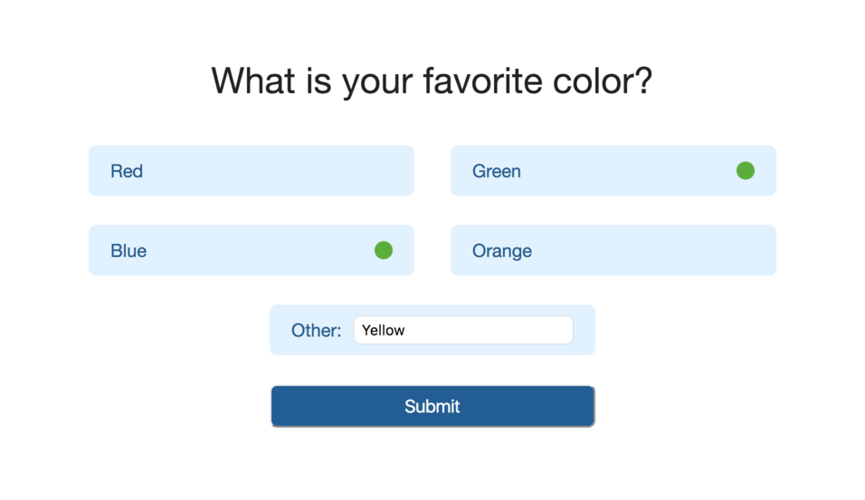

# Challenge Survey Tool
Survey Tool Coding Challenge

[GitHub Page](https://mithipster.github.io/challenge_survey/)

A simple survey tool that allows users to provide feedback.

This tool reads questions and answers from a JSON object...

```javascript
{
  "question": "What is your favorite color?",
  "answers": [ "Red", "Green", "Blue", "Orange" ],
  "submitUrl": "https://example.com/"
}
```

and then renders the following form:



You can invoked this library like so:

`
$(‘.surveyContainer’).renderSurvey(jsonObject);
`

After clicking submit, the form sends the data to the URL specified in the JSON object.
